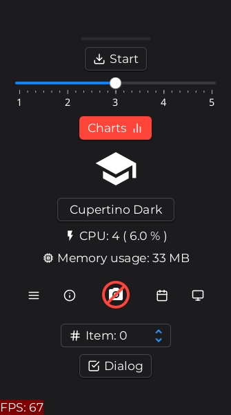
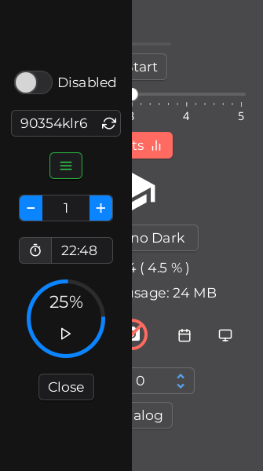
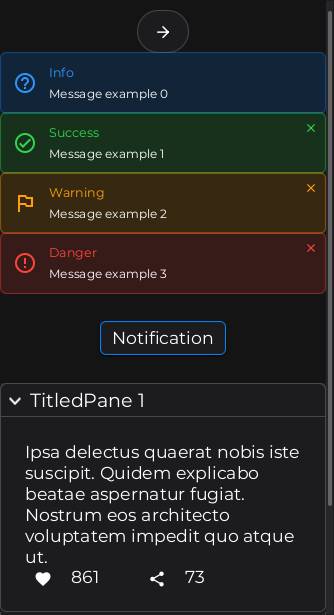
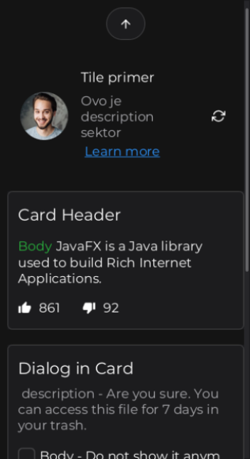
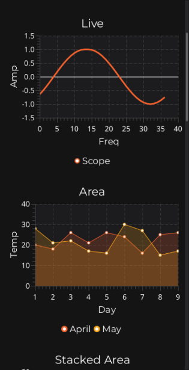

# AtlantaFX Gluon

<a href="https://github.com/CommonGrounds/AtlantaFX_Gluon/stargazers"></a>
<a href="https://github.com/CommonGrounds/AtlantaFX_Gluon/issues"></a>

Monkey testing [AtlantaFX](https://github.com/mkpaz/atlantafx) Themes implemented on [Gluon](https://gluonhq.com/services) Platform ( Desktop, Android, Ios ), using gluon
[attach](https://gluonhq.com/products/mobile/attach/) services ( display, browser,keyboard, device, connectivity, storage) and gluon 
[connect](https://docs.gluonhq.com/#_file_provider) library.<br>

Use :
```
scene.getStylesheets().add(theme.getUserAgentStylesheet());
```
in order to use default Android soft keyboard with TextField, TextArea controls.

If you use [AtlantaFX](https://github.com/mkpaz/atlantafx) default approach:

<code>Application.setUserAgentStylesheet(theme.getUserAgentStylesheet())</code>

Android ( I only tested on Android ) default soft keyboard doesn't show up on TextFied, TextArey controls<br> so you will have to create custom one.

---

 
 


---

## Documentation

Read how to create Gluon samples step by step [here](https://docs.gluonhq.com/)

## Quick Instructions

We use [GluonFX plugin](https://docs.gluonhq.com/) to build a native image for platforms including desktop, android and iOS.
Please follow the prerequisites as stated [here](https://docs.gluonhq.com/#_requirements).

### Desktop

Run the application on JVM/HotSpot:

    mvn gluonfx:run

Run the application and explore all scenarios to generate config files for the native image with:

    mvn gluonfx:runagent

Build a native image using:

    mvn gluonfx:build

Run the native image app:

    mvn gluonfx:nativerun

### Android

Build a native image for Android using:

    mvn gluonfx:build -Pandroid

Package the native image as an 'apk' file:

    mvn gluonfx:package -Pandroid

Install it on a connected android device:

    mvn gluonfx:install -Pandroid

Run the installed app on a connected android device:

    mvn gluonfx:nativerun -Pandroid

### iOS

Build a native image for iOS using:

    mvn gluonfx:build -Pios

Install and run the native image on a connected iOS device:

    mvn gluonfx:nativerun -Pios

Create an IPA file (for submission to TestFlight or App Store):

    mvn gluonfx:package -Pios